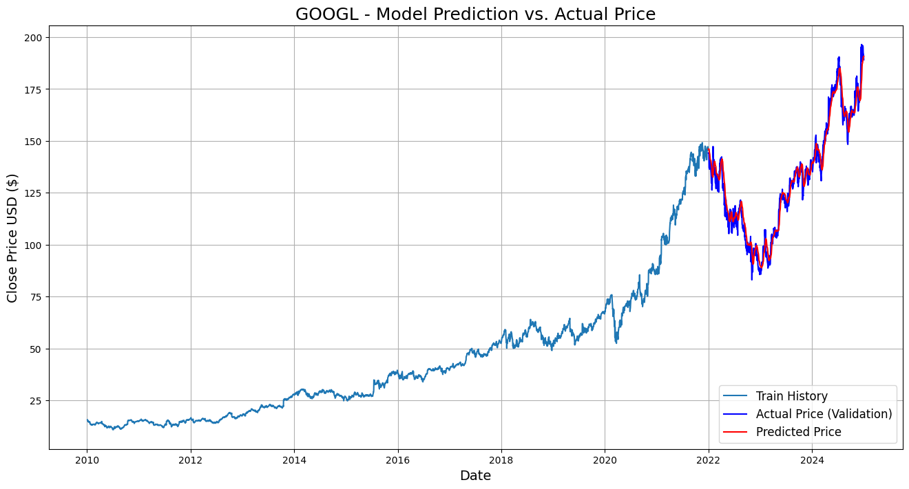

# Stock Price Prediction: Time-Series Forecasting with PyTorch and LSTMs

An end-to-end time-series forecasting project that analyzes 15 years of historical data for 5 major tech stocks and predicts future prices using a Long Short-Term Memory (LSTM) network.

---

## Table of Contents
- [Project Overview](#project-overview)
- [Features](#features)
- [Technologies Used](#technologies-used)
- [Setup and Usage](#setup-and-usage)
- [Results](#results)
- [Future Work](#future-work)

---

## Project Overview

Predicting stock market movements is a notoriously difficult task due to the market's inherent volatility. This project applies a Long Short-Term Memory (LSTM) network, a type of Recurrent Neural Network (RNN), to forecast the closing prices of five leading technology corporations: **NVIDIA (NVDA), Apple (AAPL), Microsoft (MSFT), Google (GOOGL), and Amazon (AMZN)**.

The analysis begins with a comprehensive Exploratory Data Analysis (EDA) to uncover trends and volatility patterns, followed by the development and evaluation of the forecasting model in PyTorch.

**Dataset:** The analysis is based on the `15Y Stock Data: NVDA, AAPL, MSFT, GOOGL & AMZN` dataset, containing daily trading data from January 2010 to early 2025.

---

## Features

* **In-Depth EDA:** Visual analysis of historical price trends, trading volumes, and moving averages.
* **Comparative Analysis:** Benchmarking of stock performance through normalized growth charts and expanding window analysis.
* **Time-Series Decomposition:** Statistical breakdown of the data into trend, seasonality, and residual components.
* **LSTM Forecasting Model:** A stacked LSTM network built in PyTorch to predict future closing prices based on a 20-day lookback period.
* **Quantitative Evaluation:** Model performance is measured using Root Mean Squared Error (RMSE) on both training and testing sets.
* **Interactive Visualizations:** Final prediction results are displayed using interactive Plotly charts for a clear assessment of the model's accuracy.

---

## Technologies Used

* **Python 3.x**
* **Jupyter Notebook (Google Colab)**
* **Pandas:** For data manipulation and analysis.
* **NumPy:** For numerical operations.
* **Scikit-learn:** For data preprocessing (MinMaxScaler).
* **PyTorch:** For building and training the LSTM model.
* **Matplotlib & Seaborn:** For static data visualizations.
* **Plotly:** For interactive charts.

---

## Setup and Usage

To run this project, follow these steps:

1.  **Clone the repository:**

2.  **Open the Notebook:**
    Upload and open the `stock_price_prediction.ipynb` file in Google Colab.

3.  **Install Dependencies:**
    The notebook will install all required libraries.

4.  **Run the Cells:**
    Execute the cells in order. You will be prompted to upload the `15Y_Stock_Data.csv` file when you run the first code cell.

---

## Results

The LSTM model successfully learned the underlying trends in the historical data. The final interactive Plotly chart provides a clear visual comparison between the model's predictions and the actual stock prices.

**Example: NVIDIA (NVDA) Prediction vs. Actual Price**

The model's performance was quantitatively evaluated using RMSE, providing a concrete measure of its prediction error.

---

## Future Work

This project can be expanded in several ways:

* **Multivariate Analysis:** Incorporate additional features like trading volume and technical indicators (RSI, MACD) to improve accuracy.
* **Sentiment Analysis:** Integrate sentiment data from financial news or social media to allow the model to react to market news.
* **Hyperparameter Optimization:** Use techniques like Grid Search or Bayesian Optimization to find the optimal model configuration.
* **Advanced Architectures:** Experiment with more complex models like GRUs or LSTMs with Attention mechanisms.
